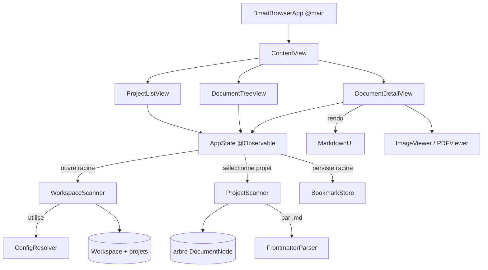

# Architecture — BmadBrowser

> Miroir français de `ARCHITECTURE_EN.md` (source de vérité). Les deux fichiers
> doivent refléter exactement les mêmes changements, édités dans le même tour.

## 1. Vue d'ensemble

BmadBrowser est une application macOS native (SwiftUI) pour **naviguer et éditer**
les artefacts markdown produits par la méthode
[BMad](https://github.com/bmad-code-org/BMAD-METHOD) (v6).

Elle s'organise autour de trois niveaux imbriqués :

1. **Workspace** — une racine qui regroupe un ou plusieurs projets.
2. **Projet** — un projet BMad (sa propre config `_bmad/` et son dossier de sortie).
3. **Document** — un fichier du dossier de sortie du projet (markdown, image, PDF, …).

L'interface reflète ces niveaux dans une disposition à 3 colonnes.

## 2. Stack technique

| Sujet | Choix |
|-------|-------|
| UI | SwiftUI, macOS 14+ |
| État | `@Observable` (framework Observation) |
| Rendu markdown | [MarkdownUI](https://github.com/gonzalezreal/swift-markdown-ui) (SPM) |
| PDF | PDFKit |
| Génération du projet | [XcodeGen](https://github.com/yonaskolb/XcodeGen) — `project.yml` est la source de vérité, le `.xcodeproj` est généré |
| Sandbox | App Sandbox + `files.user-selected.read-write` + security-scoped bookmarks |

## 3. Arborescence du projet

```
project.yml                  # définition XcodeGen (source de vérité)
Sources/
  BmadBrowserApp.swift       # point d'entrée @main + commandes de menu
  Models/
    Workspace.swift          # niveau supérieur : racine + projets découverts
    BmadProject.swift         # un projet : URL racine + dossier de sortie résolu
    DocumentNode.swift        # nœud d'arbre (fichier ou dossier)
    Frontmatter.swift         # métadonnées YAML parsées
  Services/
    WorkspaceScanner.swift    # découvre les projets sous une racine
    ProjectScanner.swift      # construit l'arbre de documents d'un projet
    ConfigResolver.swift      # résout le dossier de sortie BMad + détection projet
    FrontmatterParser.swift   # extrait / réécrit le bloc YAML --- ... ---, champs scalaires
    BookmarkStore.swift       # persiste l'accès à la racine (un seul accès scoped actif)
    RecentsStore.swift        # racines récemment ouvertes (bookmarks scoped par entrée)
    FolderWatcher.swift       # surveillance FSEvents pour le rafraîchissement auto
  ViewModels/
    AppState.swift            # @Observable, source unique de l'état UI
  Views/
    ContentView.swift         # NavigationSplitView 3 colonnes + Open Recent + dialogue non sauvegardé
    ProjectListView.swift     # colonne 1 : projets du workspace
    DocumentTreeView.swift    # colonne 2 : arbre + badges, filtre, menu contextuel
    DocumentDetailView.swift  # colonne 3 : rendu markdown / éditeur + Cmd+S + FrontmatterEditorView
    MediaViews.swift          # ImageViewer (zoom, SVG) + PDFViewer
Resources/                    # entitlements, catalogue d'assets
  Localizable.xcstrings        # String Catalog : base anglaise + traductions françaises
Tests/
  FrontmatterParserTests.swift # round-trip + édition des champs scalaires
  ConfigResolverTests.swift    # détection projet + fallbacks du dossier de sortie
Scripts/
  release.sh                   # build Release, signature Developer ID, notarisation, packaging DMG
docs/
  index.html                   # landing page bilingue (GitHub Pages)
.swiftlint.yml                 # config SwiftLint (phase de build optionnelle)
```

## 4. Diagramme des composants



## 5. Modèles

- **`Workspace`** — `rootURL`, `projects: [BmadProject]`, `isSingleProject`.
  Le niveau supérieur. `isSingleProject` vaut `true` quand la racine choisie est
  elle-même un projet (mode mono-projet).
- **`BmadProject`** — `rootURL` (dossier du projet) + `outputURL` (dossier
  d'artefacts résolu). `name` = dernier composant du chemin racine.
- **`DocumentNode`** — nœud (classe) de l'arbre de documents. Porte `url`,
  `isDirectory`, `children` optionnels, `frontmatter` optionnel. Expose
  `isMarkdown`, `isImage`, `isPDF`, `isText` (yaml/yml/json/txt/csv/toml),
  `isEditable` (markdown ou texte), et un `systemImage` pour l'icône de ligne.
- **`Frontmatter`** — clés/valeurs YAML parsées, avec un accès pratique `status`.

## 6. Services

- **`WorkspaceScanner.scan(rootURL:)`** — point d'entrée à l'ouverture d'une racine.
  - Si la racine **elle-même** ressemble à un projet BMad → workspace mono-projet
    (`isSingleProject = true`).
  - Sinon scanne les **sous-dossiers directs** et retient ceux qui ressemblent à
    un projet BMad, triés par nom.
- **`ConfigResolver`** —
  - `looksLikeBmadProject(_:)` → `true` si le dossier contient `_bmad/`,
    `_bmad-output/` ou `docs/`. C'est la règle de détection de projet.
  - `resolveOutputFolder(projectRoot:)` → lit `_bmad/config.toml`
    (`output_folder`, en résolvant `{project-root}`), avec fallbacks `docs/`,
    `_bmad-output/`, sinon la racine elle-même.
- **`ProjectScanner.buildTree(at:)`** — construit récursivement l'arbre
  `DocumentNode` d'un dossier de sortie, en ne gardant que les extensions visibles
  (md, images, pdf, xlsx, …), en ignorant les dossiers vides, et en parsant le
  frontmatter des fichiers `.md`.
- **`FrontmatterParser`** — extrait le bloc YAML `--- … ---` en tête.
- **`BookmarkStore`** — enregistre/restaure un security-scoped bookmark vers la
  **racine du workspace** dans `UserDefaults`.

## 7. État & flux de données (`AppState`)

`AppState` est l'unique source de vérité `@Observable`, détenue par l'app et liée
aux vues.

État clé : `workspace`, `project` (sélectionné), `tree`, `selection`,
`documentBody`, `currentFrontmatter`, `isEditing`, `isDirty`, `searchText`,
`errorMessage`.

Flux principaux :

- **Ouvrir une racine** — `open(rootURL:persist:)` lance `WorkspaceScanner.scan`,
  stocke le workspace, persiste le bookmark de la racine, puis sélectionne
  automatiquement le premier projet (ou affiche une erreur si aucun trouvé).
- **Sélectionner un projet** — `selectProject(_:)` construit l'arbre de documents
  du dossier de sortie du projet et réinitialise sélection/éditeur.
- **Sélectionner un document** — `select(_:)` charge le markdown (en séparant
  frontmatter et corps), charge le contenu brut des fichiers texte
  (yaml/json/…), ou laisse le corps vide pour les médias rendus par la vue détail.
- **Éditer & sauvegarder** — l'éditeur bascule `isEditing` ; `markDirty()` suit les
  modifications ; `save()` réécrit le markdown en **`frontmatter.rawBlock` + corps**
  (le bloc YAML d'origine, tel quel) ou le texte brut sur disque (`⌘S`). Il ne
  reconstruit jamais le bloc depuis un dictionnaire non ordonné : l'ordre des clés
  et les listes YAML sont préservés. Après sauvegarde d'un markdown, le frontmatter
  du nœud est rafraîchi pour garder le badge de l'arbre à jour.
- **Formulaire frontmatter** — `frontmatterFields` expose les lignes scalaires
  `clé: valeur` ; `applyFrontmatterEdits(_:)` ne réécrit que ces lignes dans
  `rawBlock`, laissant listes/blocs intacts (feuille `FrontmatterEditorView`).
- **Garde des modifications** — `guardUnsaved(_:)` intercepte les changements de
  document/projet quand `isDirty` et diffère l'action derrière un dialogue
  Save / Discard / Cancel.
- **Recharger & rafraîchir** — `reload()` re-scanne la racine, conserve le projet
  courant et re-sélectionne le document ouvert. `FolderWatcher` (FSEvents) déclenche
  `autoReloadIfSafe()`, qui saute le reload pendant une édition pour ne pas l'écraser.
- **Rechercher & filtrer** — `filteredTree` filtre par **nom et contenu** (mis en
  cache) depuis `searchText`, et par `statusFilter` (statut du frontmatter).
- **Racines récentes** — `RecentsStore` garde jusqu'à 8 racines récentes en bookmarks
  scoped ; `openRecent(_:)` en résout et rouvre une.

## 8. Disposition de l'interface

`ContentView` est un `NavigationSplitView` à 3 colonnes :

```
┌─────────┬──────────────┬─────────────┐
│ PROJETS │ DOCUMENTS    │   DÉTAIL    │
│ • ProjA │ ▸ docs/      │  # Titre    │
│   ProjB │   ▸ prd.md   │  contenu…   │
└─────────┴──────────────┴─────────────┘
```

- **Colonne 1 — `ProjectListView`** : en-tête du workspace (nom + nombre de
  projets) et liste des projets ; en sélectionner un appelle `selectProject`.
- **Colonne 2 — `DocumentTreeView`** : en-tête du projet + arbre latéral avec
  badges de statut ; filtrable par nom.
- **Colonne 3 — `DocumentDetailView`** : rendu MarkdownUI ou `TextEditor` pour le
  markdown, visionneuse/éditeur monospace pour les fichiers texte (yaml/json/…),
  barre de frontmatter, visionneuses image/PDF, et la toolbar éditer/enregistrer
  (affichée pour tout document `isEditable`).

Titre de la fenêtre = nom du workspace ; sous-titre = `projet › document`.

## 9. Persistance & sandbox

L'app est sandboxée. L'utilisateur accorde l'accès via `NSOpenPanel` ; cet accès
est persisté par un **security-scoped bookmark** de la racine du workspace
(`BookmarkStore`), restauré au lancement via `restoreLastProject()`.

## 10. Build

```bash
xcodegen generate
xcodebuild -project BmadBrowser.xcodeproj -scheme BmadBrowser -destination 'platform=macOS' build
```

`project.yml` fait foi ; régénérer après ajout/suppression de fichiers source.

> **Piège du catalogue d'assets** — une target XcodeGen n'a **pas de clé
> `resources:`** ; le catalogue d'assets doit être sous `sources:`. Le mettre sous
> `resources:` le fait silencieusement ignorer (pas de `Assets.car`, pas de
> `CFBundleIconName`, icône par défaut).

## 11. Icône de l'app

`Resources/Assets.xcassets/AppIcon.appiconset` est générée par un script Swift
autonome (AppKit/CoreGraphics) qui rend l'icône vectoriellement à chaque taille
requise (16→1024, @1x/@2x) : squircle dégradé avec carte document markdown et
pastille de statut verte. `ASSETCATALOG_COMPILER_APPICON_NAME: AppIcon` la câble ;
le catalogue est compilé par `actool` car il est sous `sources:`.

## 12. Localisation (i18n)

L'app est bilingue (anglais / français) et suit la langue système de macOS.

- **Langue de base** : anglais. Tout le code UI utilise des clés littérales
  anglaises (`Text("Open Root…")`, etc.) plutôt que du texte français en dur —
  le texte français codé en dur auparavant a été migré vers des clés anglaises.
- **String Catalog** : `Resources/Localizable.xcstrings` est la source unique
  des traductions. Il porte les chaînes françaises pour chaque clé anglaise, y
  compris les variantes plurielles via des règles de pluriel façon
  `.stringsdict` (ex. `%lld projects`).
- **Intégration au build** : `project.yml` déclare
  `options.developmentLanguage: en` et liste `Resources/Localizable.xcstrings`
  sous `sources:` de la target (même règle que pour le catalogue d'assets — il
  doit être sous `sources:`, pas `resources:`, pour être compilé). Le système
  de build d'Xcode compile automatiquement le catalogue en bundles
  `.strings`/`.stringsdict` `en.lproj` et `fr.lproj` ; aucun dossier `.lproj`
  manuel n'est versionné.
- **Chaînes hors SwiftUI** : les chemins de code en dehors des vues `Text` de
  SwiftUI — messages d'erreur exposés par `AppState`, et libellés de prompt /
  boutons du `NSOpenPanel` — utilisent `String(localized:)` avec les mêmes
  clés anglaises pour résoudre via le même catalogue.
- **Comportement à l'exécution** : pas de sélecteur de langue dans l'app ;
  l'app suit simplement la langue système macOS de l'utilisateur, avec repli
  sur l'anglais si le français n'est pas la langue système.

## 13. Distribution

- **Versionnage** : `MARKETING_VERSION` dans `project.yml` (actuellement `1.0.0`).
- **`Scripts/release.sh <version>`** — pipeline de release de bout en bout :
  1. Vérifie que `MARKETING_VERSION` dans `project.yml` correspond à la
     version demandée.
  2. `xcodegen generate`, puis `xcodebuild -configuration Release` avec
     `CODE_SIGNING_ALLOWED=NO` (signature manuelle pour éviter les problèmes
     de xattr `com.apple.provenance` posés par `lsregister` lors des builds
     Release).
  3. Copie l'app buildée dans un dossier temporaire propre (`ditto
     --norsrc --noextattr --noacl`) pour retirer les xattrs qui font échouer
     `codesign --force` en place.
  4. Signe d'abord les frameworks/dylibs imbriqués, puis l'app elle-même,
     avec `--options runtime --timestamp` (Hardened Runtime) — identité de
     signature `Developer ID Application: Vincent LAURIAT (KFLACS69T9)`.
     Inclut une boucle de nouvelle tentative car le serveur de timestamp
     Apple est parfois flaky.
  5. Packagé l'app signée dans un DMG (avec un alias `/Applications`) sous
     `release/BmadBrowser-<version>.dmg`.
  6. Soumet le DMG à la **notarisation** via `xcrun notarytool submit
     --keychain-profile "AppliMacVincentGithub" --wait`, puis agrafe le
     ticket (`xcrun stapler staple`) et le valide.
  7. Une variable d'environnement `SKIP_NOTARIZE=1` permet un essai local
     (build + signature + DMG, sans notarisation).
- **Prérequis** : XcodeGen, et le certificat `Developer ID Application:
  Vincent LAURIAT (KFLACS69T9)` dans le trousseau de connexion. Les
  identifiants de notarisation sont stockés dans le profil trousseau partagé
  `AppliMacVincentGithub` (partagé entre les apps Mac de Vincent, pas
  spécifique au projet).
- **Publication** : le DMG notarisé est attaché à une GitHub Release
  (`vincentlauriat/BmadBrowser`, désormais un dépôt **public**). La landing
  page bilingue `docs/index.html` est servie via **GitHub Pages** à
  `https://vincentlauriat.github.io/BmadBrowser/`, et l'app est référencée
  sur le portfolio github.io de Vincent ainsi que sur lauriat.fr.
