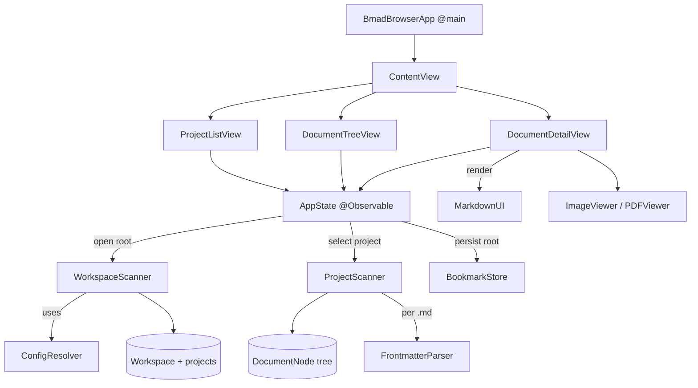

# Architecture — BmadBrowser

> Source of truth. The French mirror lives in `ARCHITECTURE.md` and must reflect
> exactly the same changes in the same edit.

## 1. Overview

BmadBrowser is a native macOS (SwiftUI) app to **browse and edit** the markdown
artifacts produced by the [BMad](https://github.com/bmad-code-org/BMAD-METHOD) (v6)
method.

It is organized around three nested levels:

1. **Workspace** — a root folder that groups one or more projects.
2. **Project** — a BMad project (its own `_bmad/` config and output folder).
3. **Document** — a file inside the project's output folder (markdown, image, PDF, …).

The UI mirrors these levels in a 3-column layout.

## 2. Tech stack

| Concern | Choice |
|---------|--------|
| UI | SwiftUI, macOS 14+ |
| State | `@Observable` (Observation framework) |
| Markdown rendering | [MarkdownUI](https://github.com/gonzalezreal/swift-markdown-ui) (SPM) |
| PDF | PDFKit |
| Project generation | [XcodeGen](https://github.com/yonaskolb/XcodeGen) — `project.yml` is the source of truth, the `.xcodeproj` is generated |
| Sandbox | App Sandbox + `files.user-selected.read-write` + security-scoped bookmarks |

## 3. Project layout

```
project.yml                  # XcodeGen definition (source of truth)
Sources/
  BmadBrowserApp.swift       # @main entry point + menu commands
  Models/
    Workspace.swift          # top level: root + discovered projects
    BmadProject.swift         # a project: root URL + resolved output folder
    DocumentNode.swift        # tree node (file or directory)
    Frontmatter.swift         # parsed YAML metadata
  Services/
    WorkspaceScanner.swift    # discovers projects under a root
    ProjectScanner.swift      # builds the document tree of a project
    ConfigResolver.swift      # resolves the BMad output folder + project detection
    FrontmatterParser.swift   # extracts the --- ... --- YAML block
    BookmarkStore.swift       # persists access to the workspace root
  ViewModels/
    AppState.swift            # @Observable single source of UI state
  Views/
    ContentView.swift         # 3-column NavigationSplitView
    ProjectListView.swift     # column 1: projects of the workspace
    DocumentTreeView.swift    # column 2: document tree + status badges
    DocumentDetailView.swift  # column 3: markdown render / editor + Cmd+S
    MediaViews.swift          # ImageViewer (zoom) + PDFViewer
Resources/                    # entitlements, asset catalog
```

## 4. Component diagram



## 5. Models

- **`Workspace`** — `rootURL`, `projects: [BmadProject]`, `isSingleProject`.
  The top level. `isSingleProject` is `true` when the chosen root is itself a
  project (single-project mode).
- **`BmadProject`** — `rootURL` (project folder) + `outputURL` (resolved artifact
  folder). `name` is the root's last path component.
- **`DocumentNode`** — a class node of the document tree. Holds `url`,
  `isDirectory`, optional `children`, optional `frontmatter`. Exposes
  `isMarkdown`, `isImage`, `isPDF`, and a `systemImage` for the row icon.
- **`Frontmatter`** — parsed YAML key/values, with a convenience `status`.

## 6. Services

- **`WorkspaceScanner.scan(rootURL:)`** — entry point for opening a root.
  - If the root **itself** looks like a BMad project → returns a single-project
    workspace (`isSingleProject = true`).
  - Otherwise scans the **direct subfolders** and keeps those that look like a
    BMad project, sorted by name.
- **`ConfigResolver`** —
  - `looksLikeBmadProject(_:)` → `true` if the folder contains `_bmad/`,
    `_bmad-output/` or `docs/`. This is the project-detection rule.
  - `resolveOutputFolder(projectRoot:)` → reads `_bmad/config.toml`
    (`output_folder`, resolving `{project-root}`), with fallbacks `docs/`,
    `_bmad-output/`, else the root itself.
- **`ProjectScanner.buildTree(at:)`** — recursively builds the `DocumentNode`
  tree of an output folder, keeping only visible extensions (md, images, pdf,
  xlsx, …), skipping empty directories, parsing frontmatter for `.md` files.
- **`FrontmatterParser`** — extracts the leading `--- … ---` YAML block.
- **`BookmarkStore`** — saves/restores a security-scoped bookmark to the
  **workspace root** in `UserDefaults`.

## 7. State & data flow (`AppState`)

`AppState` is the single `@Observable` source of truth held by the app and bound
into the views.

Key state: `workspace`, `project` (selected), `tree`, `selection`,
`documentBody`, `currentFrontmatter`, `isEditing`, `isDirty`, `searchText`,
`errorMessage`.

Main flows:

- **Open a root** — `open(rootURL:persist:)` runs `WorkspaceScanner.scan`, stores
  the workspace, persists the root bookmark, then auto-selects the first project
  (or shows an error if none found).
- **Select a project** — `selectProject(_:)` builds the document tree for the
  project's output folder and resets the selection/editor state.
- **Select a document** — `select(_:)` loads markdown (splitting frontmatter from
  body) or leaves the body empty for media files rendered by the detail view.
- **Edit & save** — the editor toggles `isEditing`; `markDirty()` tracks unsaved
  changes; `save()` writes frontmatter + body back to disk (`⌘S`).
- **Reload** — `reload()` re-scans the workspace root (picks up added/removed
  projects), keeps the current project (matched by `rootURL`) and re-selects the
  previously open document when still present.
- **Filter** — `filteredTree` filters the tree by file name from `searchText`.

## 8. UI layout

`ContentView` is a 3-column `NavigationSplitView`:

```
┌─────────┬──────────────┬─────────────┐
│ PROJECTS│ DOCUMENTS    │   DETAIL    │
│ • ProjA │ ▸ docs/      │  # Title    │
│   ProjB │   ▸ prd.md   │  content…   │
└─────────┴──────────────┴─────────────┘
```

- **Column 1 — `ProjectListView`**: workspace header (name + project count) and
  the list of projects; selecting one calls `selectProject`.
- **Column 2 — `DocumentTreeView`**: project header + sidebar tree with status
  badges; searchable by name.
- **Column 3 — `DocumentDetailView`**: MarkdownUI render or `TextEditor`,
  frontmatter bar, image/PDF viewers, and the edit/save toolbar.

Window title = workspace name; subtitle = `project › document`.

## 9. Persistence & sandbox

The app runs sandboxed. The user grants access through `NSOpenPanel`; that access
is persisted via a **security-scoped bookmark** of the workspace root
(`BookmarkStore`), restored on launch via `restoreLastProject()`.

## 10. Build

```bash
xcodegen generate
xcodebuild -project BmadBrowser.xcodeproj -scheme BmadBrowser -destination 'platform=macOS' build
```

`project.yml` is authoritative; regenerate after adding/removing source files.
