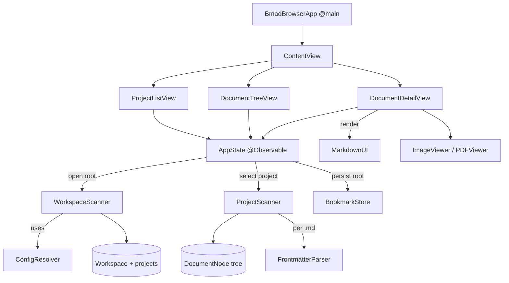

# Architecture — BmadBrowser

> Source of truth. The French mirror lives in `ARCHITECTURE.md` and must reflect
> exactly the same changes in the same edit.

## 1. Overview

BmadBrowser is a native macOS (SwiftUI) app to **browse and edit** the markdown
artifacts produced by the [BMad](https://github.com/bmad-code-org/BMAD-METHOD) (v6)
method.

It is organized around three nested levels:

1. **Workspace** — a root folder that groups one or more projects.
2. **Project** — a BMad project (its own `_bmad/` config and output folder).
3. **Document** — a file inside the project's output folder (markdown, image, PDF, …).

The UI mirrors these levels in a 3-column layout.

## 2. Tech stack

| Concern | Choice |
|---------|--------|
| UI | SwiftUI, macOS 14+ |
| State | `@Observable` (Observation framework) |
| Markdown rendering | [MarkdownUI](https://github.com/gonzalezreal/swift-markdown-ui) (SPM) |
| PDF | PDFKit |
| Project generation | [XcodeGen](https://github.com/yonaskolb/XcodeGen) — `project.yml` is the source of truth, the `.xcodeproj` is generated |
| Sandbox | App Sandbox + `files.user-selected.read-write` + security-scoped bookmarks |

## 3. Project layout

```
project.yml                  # XcodeGen definition (source of truth)
Sources/
  BmadBrowserApp.swift       # @main + per-window RootView, menu commands, Settings scene
  Models/
    Workspace.swift          # top level: root + discovered projects
    BmadProject.swift         # a project: root URL + resolved output folder
    DocumentNode.swift        # tree node (file or directory)
    Frontmatter.swift         # parsed YAML metadata + editable scalar fields
    MarkdownOutline.swift     # splits body into per-heading sections + headings
  Services/
    WorkspaceScanner.swift    # discovers projects under a root
    ProjectScanner.swift      # builds the document tree of a project
    ConfigResolver.swift      # resolves the BMad output folder + project detection
    FrontmatterParser.swift   # extracts / rewrites the --- ... --- YAML block, scalar fields
    BookmarkStore.swift       # persists access to the workspace root (single scoped access)
    RecentsStore.swift        # recently opened roots (per-entry scoped bookmarks)
    FolderWatcher.swift       # FSEvents watcher for auto-refresh
    MarkdownPDFExporter.swift # renders the markdown view to PDF (ImageRenderer)
    UpdateChecker.swift       # GitHub Releases update check + SemVer compare
  ViewModels/
    AppState.swift            # @Observable per-window UI state (+ scoped access, update check)
  Views/
    ContentView.swift         # 3-column NavigationSplitView + Open Recent + unsaved dialog
    ProjectListView.swift     # column 1: projects of the workspace
    DocumentTreeView.swift    # column 2: document tree + status badges, filter, context menu
    DocumentDetailView.swift  # column 3: markdown sections / editor + outline + export + FrontmatterEditorView
    MediaViews.swift          # ImageViewer (zoom, SVG) + PDFViewer
    SettingsView.swift        # Preferences window (⌘,): theme, font size, stats toggle
    SyntaxHighlightedText.swift # json/yaml/toml read-mode highlighting
Resources/                    # entitlements, asset catalog
  Localizable.xcstrings        # String Catalog: English base + French translations
Tests/
  FrontmatterParserTests.swift # round-trip + scalar-field editing
  ConfigResolverTests.swift    # project detection + output-folder fallbacks
  MarkdownOutlineTests.swift   # heading extraction + section split
Scripts/
  release.sh                   # Release build, Developer ID signing, notarization, DMG packaging
docs/
  index.html                   # bilingual landing page (GitHub Pages)
.swiftlint.yml                 # SwiftLint config (optional pre-build phase)
```

## 4. Component diagram



## 5. Models

- **`Workspace`** — `rootURL`, `projects: [BmadProject]`, `isSingleProject`.
  The top level. `isSingleProject` is `true` when the chosen root is itself a
  project (single-project mode).
- **`BmadProject`** — `rootURL` (project folder) + `outputURL` (resolved artifact
  folder). `name` is the root's last path component.
- **`DocumentNode`** — a class node of the document tree. Holds `url`,
  `isDirectory`, optional `children`, optional `frontmatter`. Exposes
  `isMarkdown`, `isImage`, `isPDF`, `isText` (yaml/yml/json/txt/csv/toml),
  `isEditable` (markdown or text), and a `systemImage` for the row icon.
- **`Frontmatter`** — parsed YAML key/values, with a convenience `status`.

## 6. Services

- **`WorkspaceScanner.scan(rootURL:)`** — entry point for opening a root.
  - If the root **itself** looks like a BMad project → returns a single-project
    workspace (`isSingleProject = true`).
  - Otherwise scans the **direct subfolders** and keeps those that look like a
    BMad project, sorted by name.
- **`ConfigResolver`** —
  - `looksLikeBmadProject(_:)` → `true` if the folder contains `_bmad/`,
    `_bmad-output/` or `docs/`. This is the project-detection rule.
  - `resolveOutputFolder(projectRoot:)` → reads `_bmad/config.toml`
    (`output_folder`, resolving `{project-root}`), with fallbacks `docs/`,
    `_bmad-output/`, else the root itself.
- **`ProjectScanner.buildTree(at:)`** — recursively builds the `DocumentNode`
  tree of an output folder, keeping only visible extensions (md, images, pdf,
  xlsx, …), skipping empty directories, parsing frontmatter for `.md` files.
- **`FrontmatterParser`** — extracts the leading `--- … ---` YAML block.
- **`BookmarkStore`** — saves/restores a security-scoped bookmark to the
  **workspace root** in `UserDefaults`.

## 7. State & data flow (`AppState`)

`AppState` is the single `@Observable` source of truth held by the app and bound
into the views.

Key state: `workspace`, `project` (selected), `tree`, `selection`,
`documentBody`, `currentFrontmatter`, `isEditing`, `isDirty`, `searchText`,
`errorMessage`.

Main flows:

- **Open a root** — `open(rootURL:persist:)` runs `WorkspaceScanner.scan`, stores
  the workspace, persists the root bookmark, then auto-selects the first project
  (or shows an error if none found).
- **Select a project** — `selectProject(_:)` builds the document tree for the
  project's output folder and resets the selection/editor state.
- **Select a document** — `select(_:)` loads markdown (splitting frontmatter from
  body), loads the raw content of text files (yaml/json/…), or leaves the body
  empty for media files rendered by the detail view.
- **Edit & save** — the editor toggles `isEditing`; `markDirty()` tracks unsaved
  changes; `save()` writes markdown as **`frontmatter.rawBlock` + body** (the
  original YAML block, verbatim) or the raw text back to disk (`⌘S`). It never
  rebuilds the block from an unordered dict, so key order and YAML lists survive.
  After saving markdown the node's frontmatter is refreshed so the tree badge stays
  in sync.
- **Frontmatter form** — `frontmatterFields` exposes the scalar `key: value` lines;
  `applyFrontmatterEdits(_:)` rewrites only those lines in `rawBlock`, leaving
  lists/blocks untouched (`FrontmatterEditorView` sheet).
- **Unsaved guard** — `guardUnsaved(_:)` intercepts document/project switches while
  dirty and defers the action behind a Save / Discard / Cancel dialog.
- **Reload & auto-refresh** — `reload()` re-scans the workspace root, keeps the
  current project and re-selects the previously open document. `FolderWatcher`
  (FSEvents) triggers `autoReloadIfSafe()`, which skips the reload while editing so
  in-progress edits are never clobbered.
- **Search & filter** — `filteredTree` filters by file **name and content**
  (cached) from `searchText`, and by `statusFilter` (frontmatter status).
- **Recent roots** — `RecentsStore` keeps up to 8 recently opened roots as scoped
  bookmarks; `openRecent(_:)` resolves and reopens one.

## 8. UI layout

`ContentView` is a 3-column `NavigationSplitView`:

```
┌─────────┬──────────────┬─────────────┐
│ PROJECTS│ DOCUMENTS    │   DETAIL    │
│ • ProjA │ ▸ docs/      │  # Title    │
│   ProjB │   ▸ prd.md   │  content…   │
└─────────┴──────────────┴─────────────┘
```

- **Column 1 — `ProjectListView`**: workspace header (name + project count) and
  the list of projects; selecting one calls `selectProject`.
- **Column 2 — `DocumentTreeView`**: project header + sidebar tree with status
  badges; searchable by name.
- **Column 3 — `DocumentDetailView`**: MarkdownUI render or `TextEditor` for
  markdown, a monospace viewer/editor for text files (yaml/json/…), frontmatter
  bar, image/PDF viewers, and the edit/save toolbar (shown for any `isEditable`
  document).

Window title = workspace name; subtitle = `project › document`.

## 9. Persistence & sandbox

The app runs sandboxed. The user grants access through `NSOpenPanel`; that access
is persisted via a **security-scoped bookmark** of the workspace root
(`BookmarkStore`), restored on launch via `restoreLastProject()`.

## 10. Build

```bash
xcodegen generate
xcodebuild -project BmadBrowser.xcodeproj -scheme BmadBrowser -destination 'platform=macOS' build
```

`project.yml` is authoritative; regenerate after adding/removing source files.

> **Asset catalog gotcha** — an XcodeGen target has **no `resources:` key**; the
> asset catalog must live under `sources:`. Listing `Assets.xcassets` under
> `resources:` silently drops it (no `Assets.car`, no `CFBundleIconName`, default
> icon).

## 11. App icon

`Resources/Assets.xcassets/AppIcon.appiconset` is generated by a standalone Swift
script (AppKit/CoreGraphics) that renders the icon vectorially at every required
size (16→1024, @1x/@2x): a gradient squircle with a markdown document card and a
green status dot. `ASSETCATALOG_COMPILER_APPICON_NAME: AppIcon` wires it up; the
catalog is compiled by `actool` because it sits under `sources:`.

## 12. Localization (i18n)

The app is bilingual (English / French) and follows the macOS system language.

- **Base language**: English. All UI code uses English literal keys
  (`Text("Open Root…")`, etc.) rather than French strings — the previous
  hard-coded French text was migrated to English keys.
- **String Catalog**: `Resources/Localizable.xcstrings` is the single source of
  translations. It holds the French strings for every English key, including
  plural variants via `.stringsdict`-style plural rules (e.g. `%lld projects`).
- **Build integration**: `project.yml` declares `options.developmentLanguage: en`
  and lists `Resources/Localizable.xcstrings` under the target's `sources:`
  (same rule as the asset catalog — it must live under `sources:`, not
  `resources:`, to be compiled). Xcode's build system compiles the catalog into
  `en.lproj` and `fr.lproj` `.strings`/`.stringsdict` bundles automatically; no
  manual `.lproj` folders are checked in.
- **Non-SwiftUI strings**: code paths outside SwiftUI's `Text` views — error
  messages surfaced by `AppState`, and the `NSOpenPanel` prompt/button labels —
  use `String(localized:)` with the same English keys so they resolve through
  the same catalog.
- **Runtime behavior**: no in-app language switcher; the app simply follows the
  user's macOS system language, falling back to English if French is not the
  system language.

## 13. Distribution

- **Versioning**: `MARKETING_VERSION` in `project.yml` (currently `1.0.0`).
- **`Scripts/release.sh <version>`** — end-to-end release pipeline:
  1. Verifies `project.yml`'s `MARKETING_VERSION` matches the requested version.
  2. `xcodegen generate`, then `xcodebuild -configuration Release` with
     `CODE_SIGNING_ALLOWED=NO` (manual signing avoids `com.apple.provenance`
     xattr issues from `lsregister` during Release builds).
  3. Stages the built `.app` into a clean temp directory (`ditto
     --norsrc --noextattr --noacl`) to strip xattrs that break in-place
     `codesign --force`.
  4. Codesigns nested frameworks/dylibs first, then the app itself, with
     `--options runtime --timestamp` (Hardened Runtime) — signing identity
     `Developer ID Application: Vincent LAURIAT (KFLACS69T9)`. Includes a
     retry loop since Apple's timestamp server is occasionally flaky.
  5. Packages the signed app into a DMG (with an `/Applications` alias) at
     `release/BmadBrowser-<version>.dmg`.
  6. Submits the DMG for **notarization** via `xcrun notarytool submit
     --keychain-profile "AppliMacVincentGithub" --wait`, then staples the
     ticket (`xcrun stapler staple`) and validates it.
  7. A `SKIP_NOTARIZE=1` env var allows a local dry run (build + sign + DMG,
     no notarization).
- **Prerequisites**: XcodeGen, and the `Developer ID Application: Vincent
  LAURIAT (KFLACS69T9)` certificate in the login keychain. Notarization
  credentials are stored under the shared keychain profile
  `AppliMacVincentGithub` (shared across Vincent's Mac apps, not per-project).
- **Publishing**: the notarized DMG is attached to a GitHub Release
  (`vincentlauriat/BmadBrowser`, now a **public** repository). The bilingual
  landing page `docs/index.html` is served via **GitHub Pages** at
  `https://vincentlauriat.github.io/BmadBrowser/`, and the app is listed on
  Vincent's github.io portfolio and on lauriat.fr.
